# Android01 labor - HelloWorld

## Feladat 1
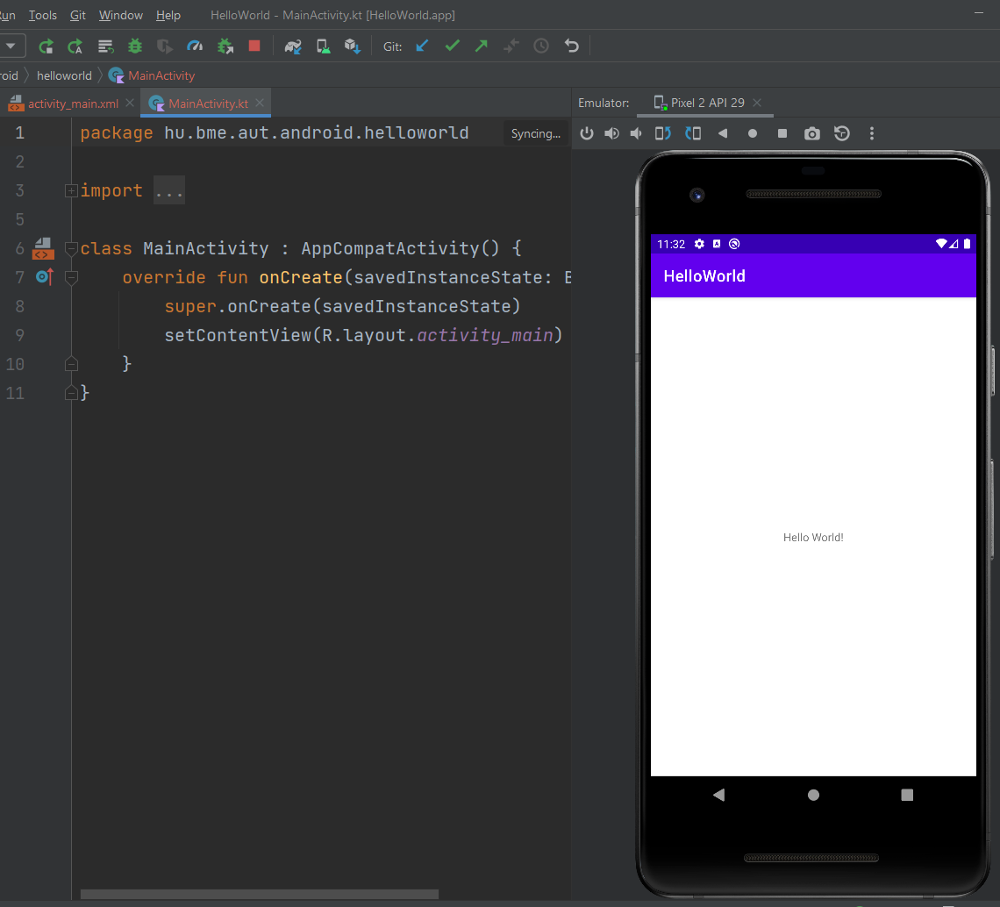
Magyarázat: Rá kellett nyomni a 'Run' gombra, a build után az alkalmazás feltelepült az emulátorra és el is indult.
## Feladat 2
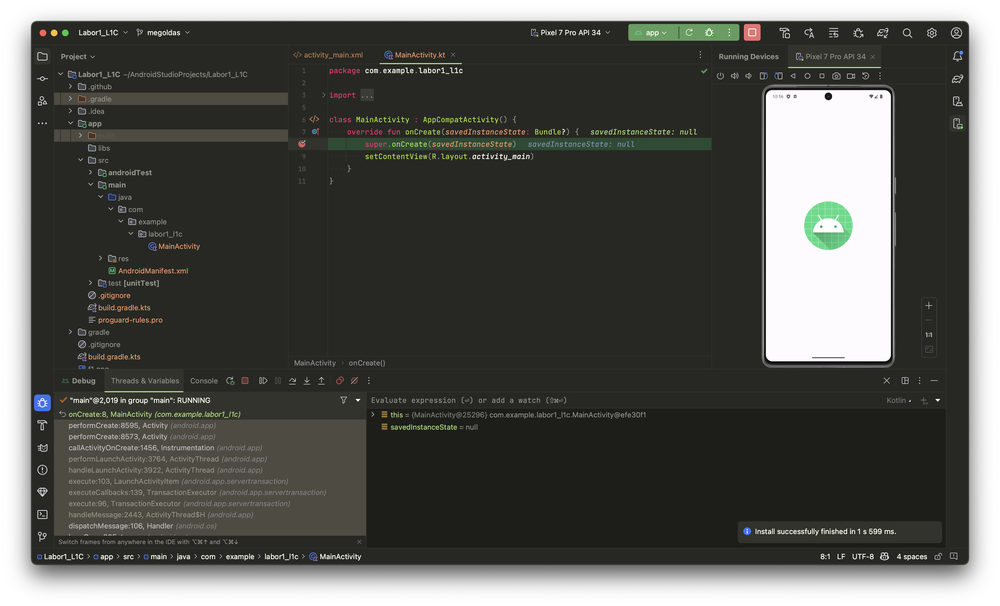
Magyarázat: Megnyomtam felül a debug gombot.
## Feladat 3
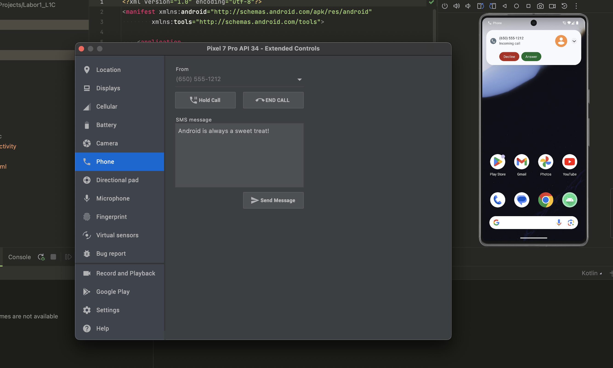
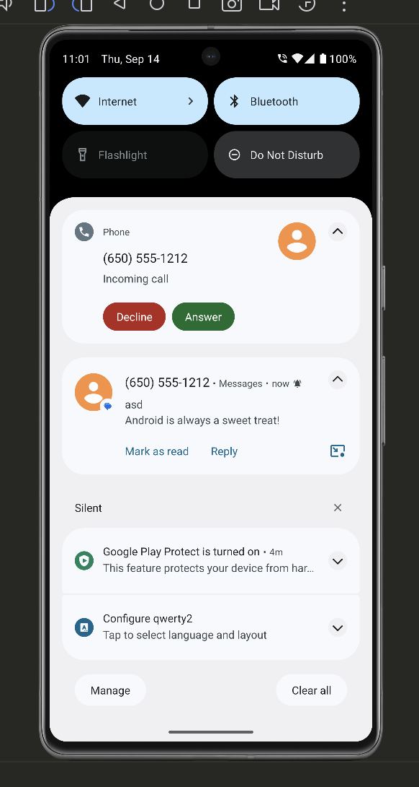
Magyarázat: A készülék akciók szimulálása menüben küldtem egy sms-t a telefonra ami sikeresen megérkezett, ezután fel is hívtam ami pedig ki is csengett.
## Feladat 4
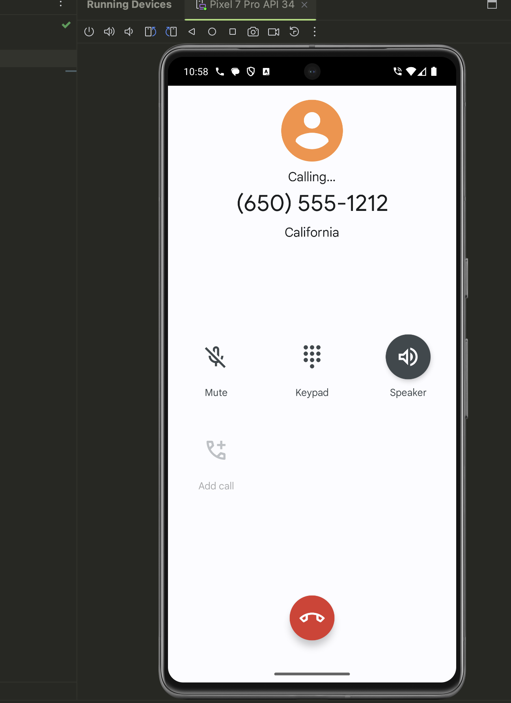
Magyarázat: Felhívtam a szimulált felet és kicsöngött de nem vettem fel.

Magyarázat: Elküldtem vissza egy üzenetet és ezt kézbesítette a szimulált félnek.
## Feladat 5
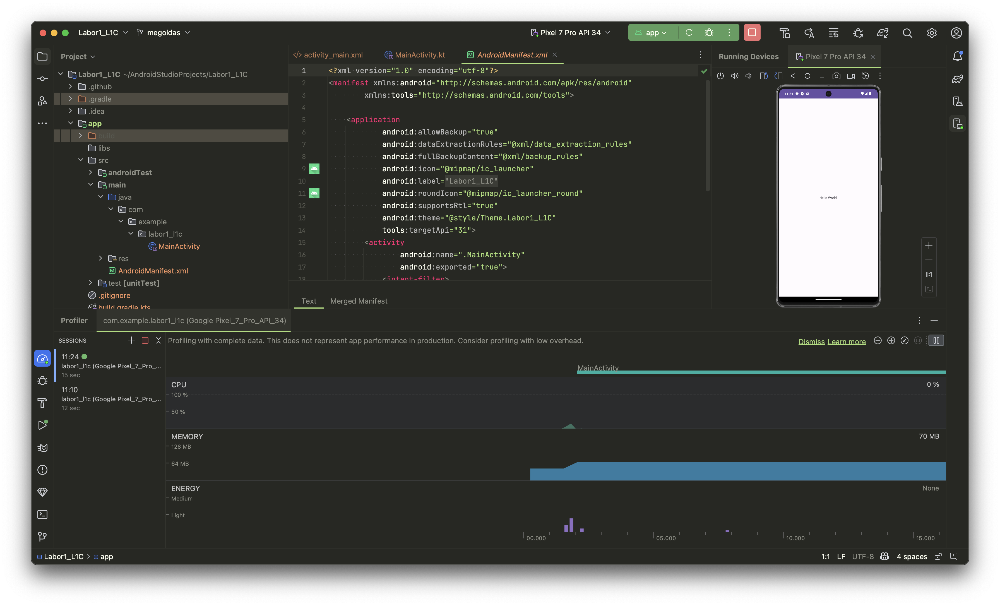
Magyarázat: A profiler mutatta, hogy mennyi erőforrást fogyaszt az alkalmazás.
## Feladat 6
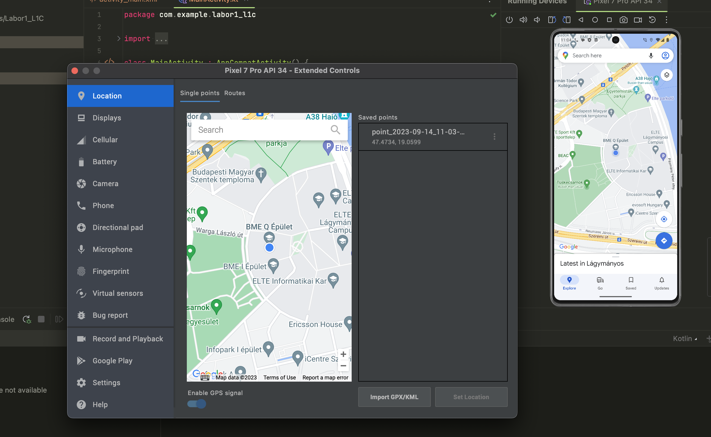
Magyarázat: Megváltoztattam a készülék tartózkodási helyét a BME Q épületbe.
## Feladat 7
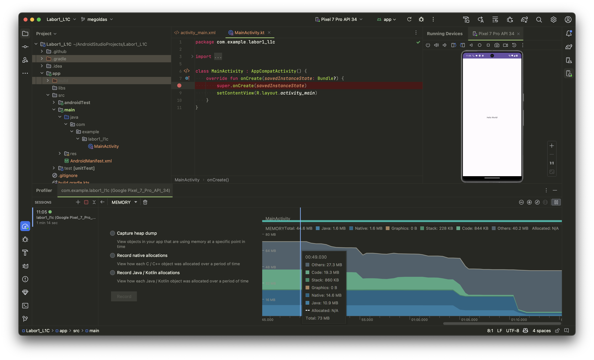
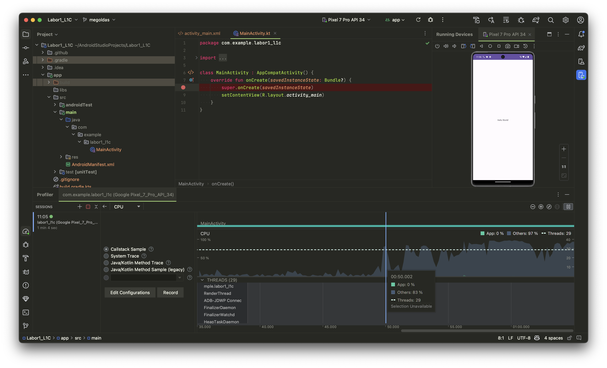
Magyarázat: Ezek a futó szálak illetve memória foglalások.
## Feladat 8
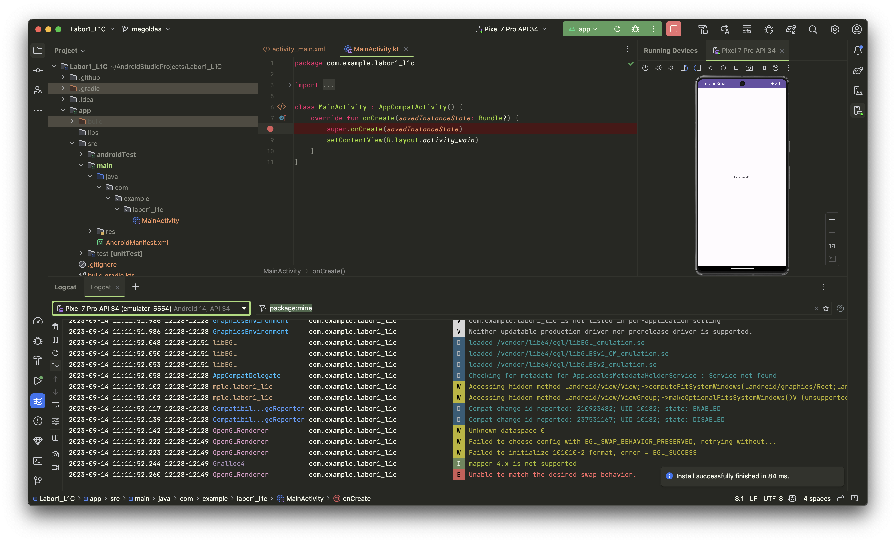
Magyarázat: A logcatban van minden logolt információ az alkalmazás futásáról. Ezt lehet szűrni kategóriák szerint.
## Feladat 9
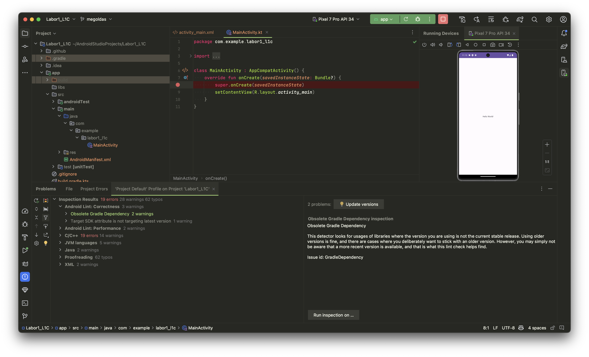
Magyarázat: Különböző hibákat vagy javaslatokat dob fel ami a kód minőségét változtathatja, vagy lehetséges egyszerűsítéseket mutat.
## Feladat 10
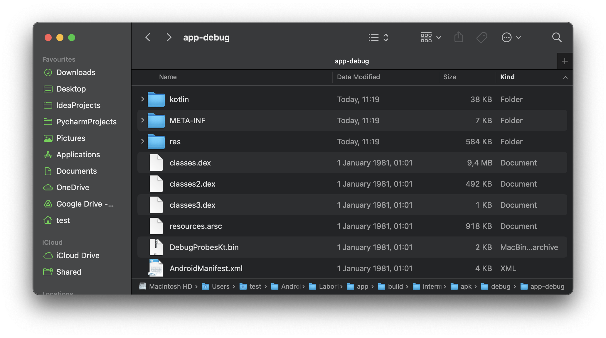
Magyarázat: A Classes.dex fileokban található a lefodtott bytecode.